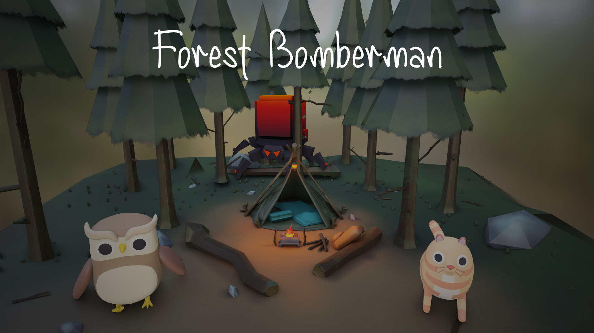
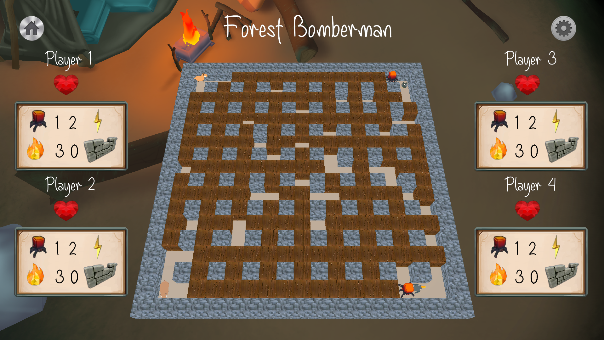
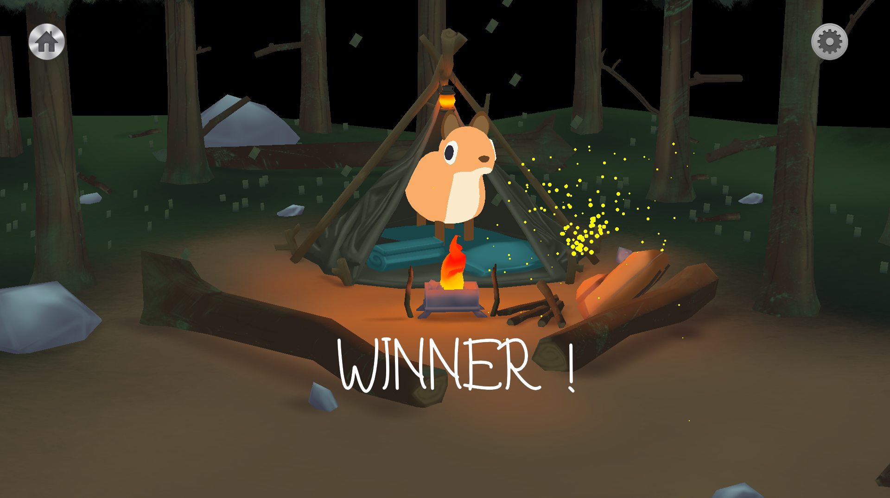
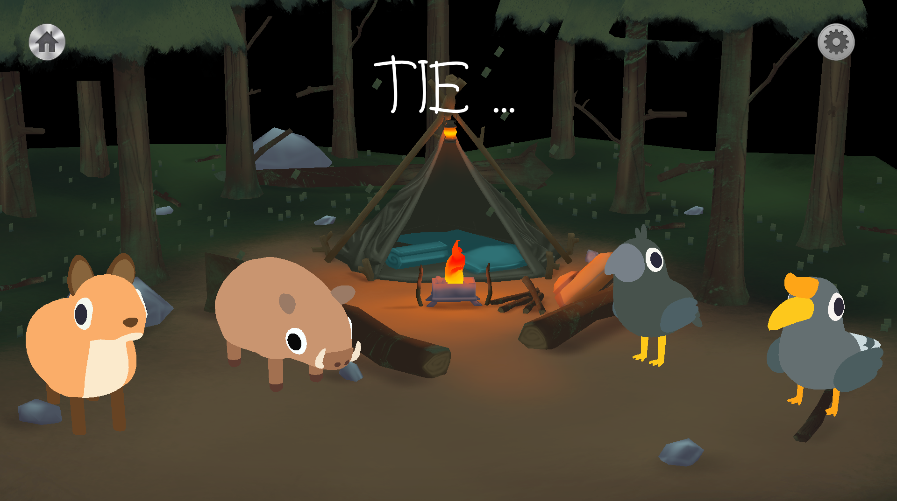
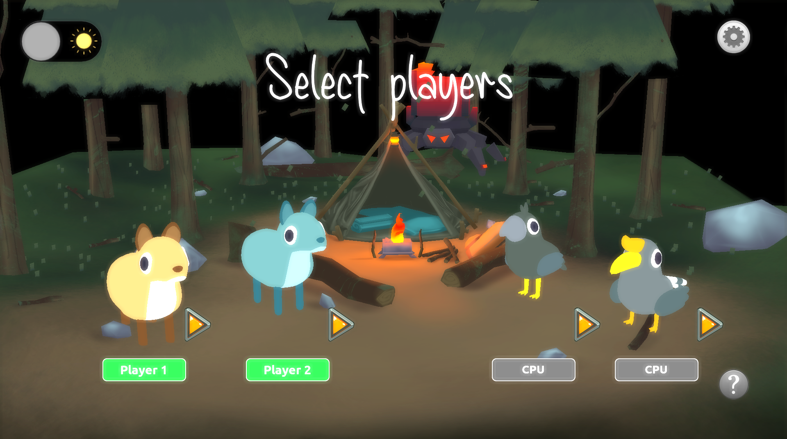

# Project Indie Studio



**The goal of this project :**

The goal of this project is not only to code a video game, but it’s to code a fully finished video game.

# Game

Place down bombs to destroy the blocks and win the game !
Use power ups to be the last player standing !

# Interactions


We can play with a keyboard and/or a controller.

# AI



The AI can play intelligently to win.

# End game



The winner is the last player alive ...



... But we can also finish with a tie, when everyone dies at the same time.

> We then display a victory screen with the winner and some cool particle effects. The music will differ whether there is a winner or it ended with a tie.

# Shader



We have implemented a shader than we can toggle in game. 

# Compilation

It is a cross-platform build system:

- **Linux**: it must generate a `Makefile` to be able to build the project

```
mkdir build && cd build
cmake .. -G "Unix Makefiles"
cmake --build .
./bomberman
```

- **Windows**: it must generate a Visual Studio solution `.sln` (will be tested with Visual Studio 2022)

```
mkdir build && cd build
cmake .. -G "Visual Studio 17"
cmake --build .
bomberman.exe
```

> We will provide a `CMAKE_MODULE_PATH` cmake variable when building the project.
