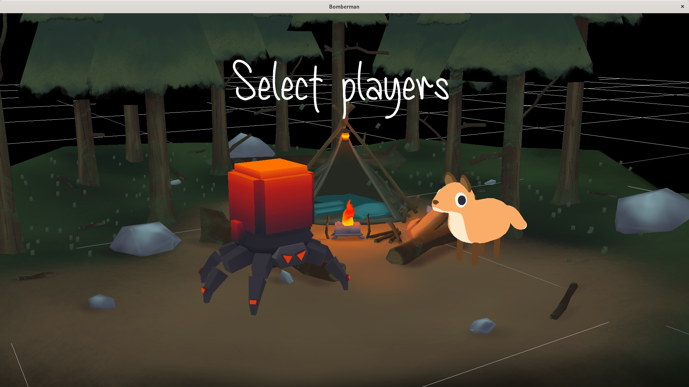
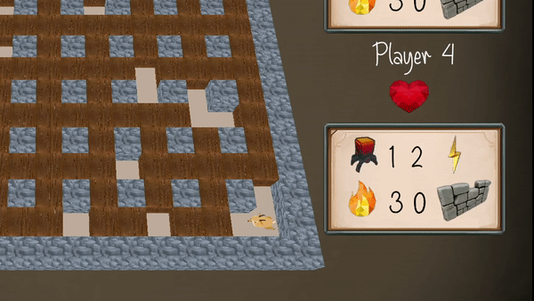

# Indie Studio



> binary name: `bomberman` <br>
> language: `c++` <br>
> compilation: `cmake 3.17`

The aim of the **Indie Studio** is to implement a **cross-platform** 3D video game with **real-world** tools.

## Compilation

Use **CMake**:

- **Linux / MacOS**:

```
mkdir build && cd build
cmake .. -G "Unix Makefiles"
cmake --build .
./bomberman
```

- **Windows**:

```
mkdir build && cd build
cmake .. -G "Visual Studio 17"
cmake --build .
bomberman.exe
```


## Library

We used `raylib` to implement the game. It is a very simple C library for 2D/3D graphics.<br>
Instead of using a `.gltf` file, the library uses `.obj` files to load 3D assets.<br>
We encapsulated `raylib` because to make our code more readable and maintainable.

## The game

> Victory Screen<br>


> Artifical Intelligence controlled bot<br>


The game we implemented is a Bomberman-like game.<br>
**Bomberman** is one of the most famous video games of all time.<br>
With over 70 franchises, ranging from the first version on MSX, ZX Spectrum and Sharp MZ-700 in 1983 to the latest versions on modern consoles, over 10 million units have been sold.

Our gameplay reference is **Neo Bomberman**, released on the Neo Geo and MVS systems in 1997.

Here’s the features we implemented:

- Local multiplayer with the possibility to play with a friend + AI’s controlled bots.
- A main game menu (to start a new game or load an existing one).
- 3D graphics but a 2D gameplay.
- **Procedurally generated maps** (random obstacles, random bonus...).
- Save/Load a game (game auto save on quit)
- Animation and sounds to give life to the game (especially during various interactions)
  - Bomb explosion, player walking, background music, ...
- Power-ups
  - Bomb Up (increase the number of bombs)
  - Speed Up (increase the player speed)
  - Fire Up (increase the range of the bomb)
  - Wall Pass (10 seconds)
- Win/Tie game over screen

We achieved to code a fully finished game within our 5 weeks time frame.
This means that the efforts you make to polish your game will count as much as the technical aspect.

## Documentation

You can see our documentation in the Documentation folder. Use vscode to open a better view, on a live server.

